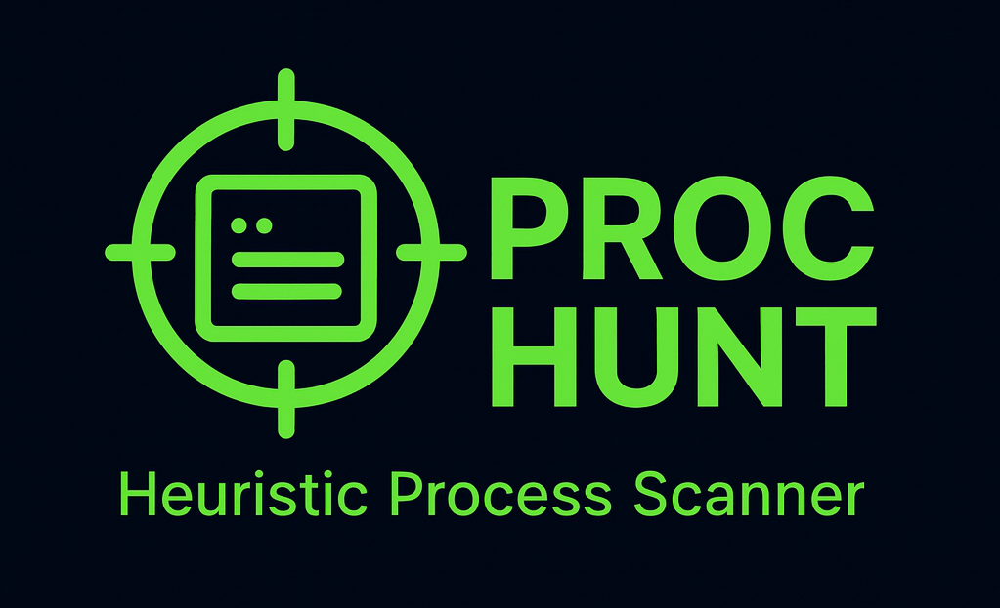
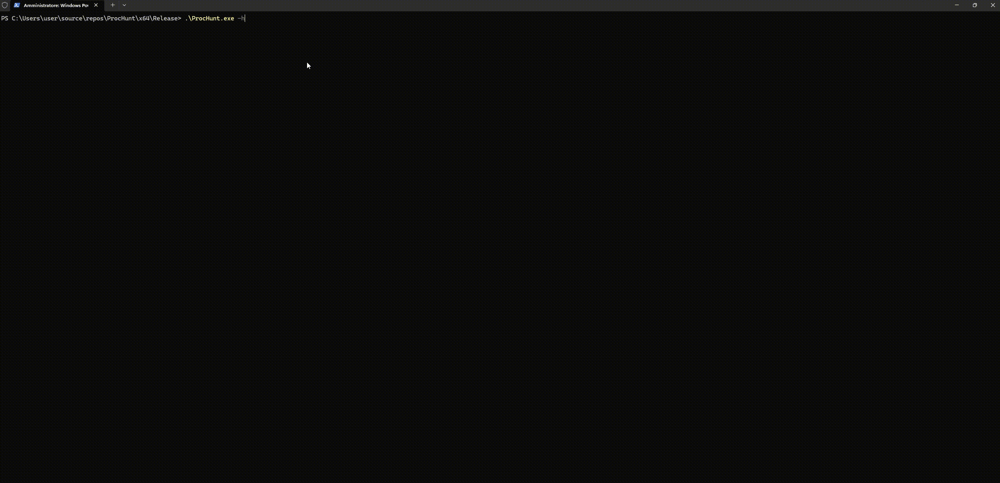

[](https://github.com/FreeDurok/ProcHunt/actions/workflows/build.yml)
[](https://github.com/FreeDurok/ProcHunt/releases)

<p align="center">
    
</p>

# ProcHunt
**Heuristic Process Scanner for Windows**

`ProcHunt` enumerates processes, parses **`PEB` → `RTL_USER_PROCESS_PARAMETERS`** to extract `ImagePathName`, `CommandLine`, `CurrentDirectory`, `WindowTitle`, `DesktopInfo`, `ShellInfo`, `RuntimeData`, etc., verifies code signing via `WinVerifyTrust`, and computes a **suspicion score** using path/CWD anomalies, `LOLBins`, masquerading, and simple obfuscation checks.

> Works fully in `user-mode`; supports cross-bitness (`WOW64`). Requires appropriate rights (ideally `Admin` for `SeDebugPrivilege`). `PPL`/Protected processes may be unreadable.

---

## Features
- `PEB`/`ProcessParameters` parsing: `ImagePathName`, `CommandLine`, `CurrentDirectory`, `WindowTitle`, `DesktopInfo`, `ShellInfo`, `RuntimeData`.
- Cross-bitness read (`x64` host → `x86` targets via `WOW64` view).
- Code-signing check (`WinVerifyTrust`); extracts `publisher` and `thumbprint`.
- Heuristics engine with `score 0–100` and human-readable reasons.
- `Whitelists`: `publisher` and `path`.
- `Text` or `JSON` output; `threshold filtering`.
- Zero drivers; single binary.

## Heuristics (overview)
- Image path in user-writable / `Temp` / `Downloads` / `UNC`/Web.
- `CWD` anomalies (`Temp`/`UNC`; `CWD ≠ image directory`; non-system binary with `System32 CWD`).
- `LOLBins` & suspicious flags (`powershell -enc`, `wscript`/`cscript`, `mshta`, `regsvr32 /i:http`, `rundll32`, `certutil`, `bitsadmin`, `curl`/`wget`, `schtasks /create`, etc.).
- Masquerading (system names out of system folders; digit/letter look-alikes).
- Obfuscation hints (`long base64 tokens`, `very long command lines`).
- Code signing: trusted lowers score when `publisher`/`path` are whitelisted; invalid/unsigned increases score.

### Limitations
- Reading some processes may fail (`PPL`/`TS`/`RPCSS`/`Secure System`).
- `RTL_USER_PROCESS_PARAMETERS` layout is not a stable ABI; fields beyond those used may vary by OS build.
- Heuristics are best-effort and may yield false positives/negatives.

## Usage

`ProcHunt.exe [options]`

- `-a`, `--all` enumerate all processes (default)
- `-p`, `--pid <PID>` single process
- `--json` JSON output
- `--min-score` | `--threshold N` show only results with `score >= N (0–100)`
- `-t N` alias for `--min-score`
- `--whitelist-pub <file>` publisher whitelist (one per line)
- `--whitelist-path <file>` path-prefix whitelist (one per line)
- **`-o`, `--output <file>` write output to UTF-8 file (recommended for JSON)**
- `-h`, `--help` usage

### Examples
```powershell
# All processes, text
.\ProcHunt.exe -a

# High-suspicion only (>=70), text
.\ProcHunt.exe --min-score 70 -a

# JSON + filter (>=50)
.\ProcHunt.exe --json --threshold 50 -a -o out.json

# Single PID
.\ProcHunt.exe -p 4321
```

### Whitelists
- `--whitelist-pub pubs.txt` — one publisher per line (e.g., `Microsoft Corporation`).
- `--whitelist-path paths.txt` — absolute path prefixes (e.g., `C:\Program Files`).

### Demo GIF

<p align="center">
    
</p>

> The GIF above is displayed at 640px width for better visibility. Click to open in a new tab for full resolution.

Watch a quick demo of ProcHunt in action.

### JSON shape (example)

```json
[
    {
        "pid": 4321,
        "name": "powershell.exe",
        "imagePath": "C:\\Windows\\System32\\WindowsPowerShell\\v1.0\\powershell.exe",
        "commandLine": "powershell -nop -w hidden -enc ...",
        "currentDirectory": "C:\\Windows\\System32",
        "signature": { "trusted": true, "status": "ERROR_SUCCESS", "publisher": "Microsoft Corporation", "thumbprint": "..." },
        "heuristics": { "score": 80, "reasons": ["LOLBin/suspicious command line", "Obfuscated/encoded command line"] }
    }
]
```

### Filtering JSON output with `jq`

You can use [`jq`](https://stedolan.github.io/jq/) to filter and process ProcHunt's JSON output. Here are some examples:

```sh
# Show all entries with score >= 40
jq --argjson min 40 '.[] | select(.heuristics.score >= $min)' out.json

# Output PID, name, and score as tab-separated values for score >= 40
jq -r --argjson min 40 '.[] | select(.heuristics.score >= $min) | [.pid, .name, .heuristics.score] | @tsv' out.json
```

These commands help you quickly extract high-suspicion processes or format results for further analysis.


### Build (`GitHub Actions`)

Builds are produced by the `CI pipeline` under `.github/workflows/build.yml`.

Local build (optional): open `ProcHunt.sln` in `Visual Studio 2022 (x64)`, or use `MSBuild`:
- `msbuild .\ProcHunt.sln /t:Build /p:Configuration=Release /p:Platform=x64 /m`
